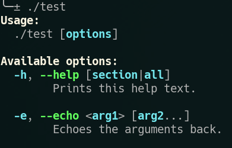

# Command-line Argument parser generator

This utility converts an argument definition input file  into  C++ source code
which,  when  compiled,  will  parse  command  line arguments according to the
definition file.

This was hammered out in about 3 days so don't expect useful error messages or
stable  code  (I might be changing this  quite  a  bit).  But  it  does  work.

## How to use

The easiest way right now  is  to  clone this repository into your project and
then    use    ```add_subdirectory()```    in    your    ```CMakeLists.txt```.

```cmake
add_subdirectory ("thirdparty/argdefgen")

argdefgen_target (myproject_argdef
    "${PROJECT_SOURCE_DIR}/src/Actions.argdef"
    "${PROJECT_BINARY_DIR}/src/Actions.argdef.cpp"
    DEFINES_FILE "${PROJECT_BINARY_DIR}/include/myproject/Actions.argdef.hpp")

add_executable (myproject
	${argdefgen_myproject_argdef_OUTPUTS})
target_include_directories (myproject
	PRIVATE $<BUILD_INTERFACE:${PROJECT_BINARY_DIR}/include>)
	...)
```

Then you can include the file ```#include "myproject/Actions.argdef.hpp``` and
call   ```parseCommandLine(argc,   argv)```   from   your   main()   function.

Note: You will need to install BISON and FLEX to compile argdefgen.

If  your  project  is  not  cmake  based then you can also  call  the  program
manually after building and installing it somewhere:

```
argdefgen --source output.cpp --header output.hpp input.argdef
```

## Simplest definition file

Here's a hello world example that you can try out:


```yaml
%source-preamble {
#include <iostream>

bool echoArgs(const std::vector<std::string>& args) {
    for (std::size_t i = 0; i < args.size(); ++i)
        std::cout << "arg[" << i << "]: " << args[i] << std::endl;
    return true;
}
%}

%action-table {
section global:
  echo(e):
    help: Echoes the arguments back.
    args: <arg1> [arg2...]
    func: echoArgs
%}

%source-postamble {
int main(int argc, char** argv)
{
    return parseCommandLine(argc, argv);
}
%}
```

Compile with:
```
argdefgen --source test.cpp input.argdef
g++ -W -o test test.cpp
./test
```

Running the above with no arguments outputs some nice colored help:



Running it with either ```./test -e foo``` or ```./test --echo foo``` will print "arg[0]: foo" as expected.

## A more complete example

Here is an example showing off a few features:

```yaml
#include <iostream>
#include <fstream>
#include <filesystem>

bool printLicense(const std::vector<std::string>& args) {
    std::cerr << "argparse example licensed under WTFPL" << std::endl;
    return true;
}

bool echoArgs(const std::vector<std::string>& args) {
    for (std::size_t i = 0; i < args.size(); ++i)
        std::cout << "arg[" << i << "]: " << args[i] << std::endl;
    return true;
}

bool echoFile(const std::vector<std::string>& args) {
    std::ifstream f(args[0]);
    if (!f.is_open()) {
        std::cerr << "Failed to open file " << args[0] << std::endl;
        return false;
    }

    std::cout << f.rdbuf() << std::endl;
    return true;
}

MetaHandlerResult echo(const std::vector<std::string>& args) {
    if (std::filesystem::is_regular_file(args[0]))
        return MetaHandlerResult{findActionId("echo-file"), {args[0]}};
    return MetaHandlerResult{findActionId("echo-args"), args};
}
%}

%action-table {
section startup:
  license:
    func: printLicense

section global:
  echo-args():
    help: Echoes the arguments back.
    args: <arg1> [arg2...]
    func: echoArgs
    runafter: startup, echo-file

  echo-file():
    help: Echoes the contents of a file.
    args: <file>
    func: echoFile
    runafter: startup

  echo(e)[echo-args, echo-file]:
    help: Echoes the arguments back, or, if a filename is specified,
          prints the contents of the file.
    args: <arg|file> [arg...]
    func: echo
    runafter: startup
%}

%source-postamble {
int main(int argc, char** argv)
{
    return parseCommandLine(argc, argv);
}
%}
```

Compiling and running it with:
```
argdefgen --source test.cpp input.argdef
g++ -std=c++17 -W -o test test.cpp
./test --echo arg --echo file.txt
argparse example licensed under WTFPL
tes tfile content

arg[0]: done

```

There's a lot going on here so lets break it down.

### Action types

There are 4 different types of actions that can be defined.

Explicit actions are  the most common type. These will appear in the help page
and  can  be  called  on  the  command  line  using  either  the  long  option
```--another-option```  or  the  short  option  ```-o```.  The short option is
optional and can be ommitted by leaving the brackets empty.
```yaml
some-option():
  ...
another-option(o):
  ...
```

Next are implicit actions. Implicit actions do not appear in the help page and
cannot be called on the command line. The only way to call implicit actions is
to  have another action depend on  it  using  the  ```runafter:```  attribute.
Implicit actions are defined by ommitting the parentheses:
```yaml
implicit-action:
  ...
```

And finally, there are  what  we  call  meta actions. These can be explicit or
implicit as well.  Meta  actions  are  used  to  generate  arguments for other
actions depending on a runtime condition. You must declare which other actions
your meta action can call. The following  means  that ```--meta``` will decide
to trigger either ```--a``` or ```--b```:
```yaml
meta()[a,b]:
  ...
```

In  our  example, we see that the  meta-action  ```echo```  will  either  call
```echo-file``` if the argument was a file, or it will call ```echo-args``` if
the argument was not a file.

Meta actions can also call  other  meta  actions,  which technically means the
argument  parser  is  turing  complete,  but  I'm  getting  ahead  of  myself.

### Dependencies

In  the  example we see that ```echo```, ```echo-args```  and  ```echo-file```
have a "runafter" dependency on ```startup```. What  this  means  is  that all
actions in the section  called  "startup"  must  run  first.  Since there is a
single  implicit action ```license``` in that section, running any of the echo
actions automatically pulls  in the license action and it gets executed first.

All implicit actions  are  always  automatically  (recursively) executed if an
action has a ```runafter``` dependency on it.

If you look at the output you might  notice  that  the  text "done" is printed
after the file was printed, even though it was specified first on  the command
line.  This  is  because  ```echo-args```  has  a   runafter   dependency   on
```echo-file```.

Runafter dependencies between explicit actions let you  enforce  an  order  of
execution of  actions,  regardless  of  how  they  appear on the command line.

There is another type of dependency that was not shown in the example called a
"requires" dependency:
```yaml
some-option():
  requires: another-option
  ...

another-option():
  runafter: some-option
  ...
```

If ```--some-option``` appears on the command line, but ```--another-option```
does not, then this will  cause  an  error. The requires dependency forces the
user to specify all depending options on the command line.

Notice  that  this  is  completely  independent  from the order  of  execution
specified by ```runafter```.

### Sections

Sections  have two purposes. The first is  to  make  depending  on  groups  of
actions  easier,  because  you  can  list  section  names  in  ```requires```,
```runafter``` and meta dependency lists. The second  use  is  it  causes  the
commands to be grouped together in the help page, and it's possible to specify
```--help  [section]```  to  print  help for  only  that  particular  section.

## Overriding the help function

The help function is added only if you don't specify an action called "help" in the input argdef file. If you want to format your help pages with your own function you can do that by adding:
```yaml
help(h):
  func: myHelpPrinter
  ...
```

## Blocks

The input argdef file is split up into "blocks" (yes  I  used a different word
because "sections" was already used).

```
%header-preamble {
%}

%header-postamble {
%}

%action-table {
%}

%source-preamble {
%}

%source-postamble {
%}
```

Any code appearing in the ```%header-*``` blocks will be prepended or appended
to the generated header file (when specifying ```--header```).

Any code appearing in the ```%source-*``` blocks will be prepended or appended
to the generated source file (specified by ```--source```).

## Other cool functionality

You can tell argdefgen to output the argument dependency graph to DOT like so:
```
argdefgen --depgraph deps.dot input.argdef
dot -Tpdf deps.dot > out.pdf
```

The resulting PDF looks like this for our example above:


The gray arrows  and  the  numbers show the runafter dependencies between each
action. The dashed arrows  show  the  meta  dependencies (the echo meta-action
will either call echo-args or echo-file). Orange nodes mean  implicit actions.
Purple nodes mean meta actions.

It's also possible to output the AST of the argdef input file:
```
argdefgen --ast ast.dot input.argdef
dot -Tpdf ast.dot > out.pdf
```

Although I don't see this being very useful for most people.


